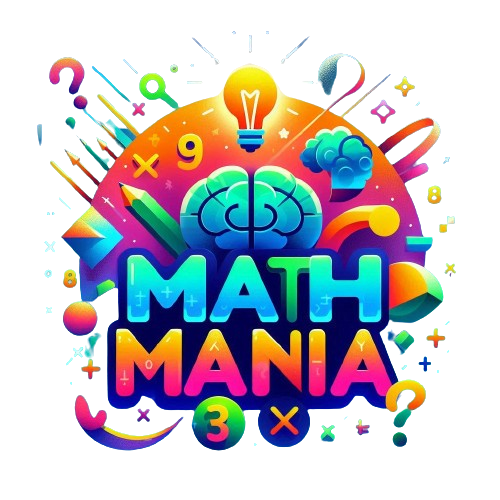

# Math Mania: Train Your Brain, Improve Math Skills

  

  <h3 align="center">Math Mania: Train Your Brain, Improve Math Skills</h3>

<h3 align="center">Math Mania is a fun math game designed to improve your math skills.</h3>
 

Simple math games to learn and improve your math skills. This game is easy to play and targets everyone from kids to adults. Every level is designed to challenge your mind at every step.

## Main Categories
All the main categories of the app are -

### Math Puzzle
This category revolves around basic calculations like addition, subtraction, division, and multiplication. Each game in this category includes simple calculations with different approaches, so you're playing with numbers and signs while racing against time.

### Memory Puzzle
This category focuses on both calculation and memory. You need to memorize numbers and signs before applying calculations to them. It engages you to solve these calculations by recalling numbers and signs in a gradual manner.

### Train Your Brain
Train Your Brain enhances your logical thinking while keeping time in mind. There can be single or multiple ways to solve the puzzles, but you need to find the best possible ways to earn the highest score.

## Features
All the main features of the app are -

### Math Puzzle Games
1. **Calculator**: Solve simple equations involving addition, subtraction, division, and multiplication. Find the correct answer in 5 seconds.
2. **Guess the Sign**: Complete the equation by placing the correct sign between two numbers to reach the given answer.
3. **Correct Answer**: You'll be given 4 options and one incomplete equation with an answer. Place the correct number to complete the equation.
4. **Quick Calculation**: Perform basic calculations while racing against time. The faster you answer, the more time you'll have to solve more equations and break your own high score.

### Memory Puzzle Games
1. **Mental Arithmetic**: Numbers and signs will be shown one by one for a few seconds. Remember them and give the correct answer. This focuses on both memory and calculation.
2. **Square Root**: Find the square root of a number from given options. Each increasing level presents tougher equations.
3. **Mathematical Pairs**: Match equations with their correct answers in a randomly placed grid.
4. **Math Grid**: Select numbers from a 9x9 grid to reach the given number. Find the best possible way to solve the maximum number of equations.

### Train Your Brain Games
1. **Magic Triangle**: Place numbers in a 3x3 or 4x4 triangle so that the sum of each side equals the given number.
2. **Picture Puzzle**: Each shape represents a number. Find the number related to each shape and solve the final equation.
3. **Number Pyramid**: In a number pyramid, the numbers on the lower layers determine the numbers above them. The sum of two consecutive cells is placed in the top cell.

## About the Developer

Pabitra Banerjee, born on January 22, 2004, is the Founder & CEO of MB WEBBER'S, Code Explorer, and Dev Line Community. He is a Full-Stack AI Engineer with knowledge of Blockchain Technology and a tech enthusiast. Pabitra is dedicated to spreading science and technology to the common people and has a deep passion for astrophysics and mathematics. He actively writes about astrophysics and the latest space missions on Universal Space Missions.

## Warning: For Learning Purposes Only

This repository is intended for educational and learning purposes only. It is not meant to be directly used for commercial purposes, including publishing on app stores. Please read and follow the guidelines provided in the repository.

## Built With

This application is built with [Flutter](https://flutter.dev/), a cross-platform open-source mobile framework by Google, using Dart as the primary language.

## Roadmap

See the [open issues](https://github.com/PB2204/Math-Mania/issues) for a list of proposed features and known issues.

## Contributing

Contributions are welcome and greatly appreciated!

1. Fork the Project
2. Create your Feature Branch (`git checkout -b feature/AmazingFeature`)
3. Commit your Changes (`git commit -m 'Add some AmazingFeature'`)
4. Push to the Branch (`git push origin feature/AmazingFeature`)
5. Open a Pull Request

## Contact

[Pabitra Banerjee](https://www.linkedin.com/in/pabitra-banerjee)

## This app uses the following open-source libraries

- [provider](https://pub.dev/packages/provider)
- [vsync_provider](https://pub.dev/packages/vsync_provider)
- [get_it](https://pub.dev/packages/get_it)
- [shared_preferences](https://pub.dev/packages/shared_preferences)
- [flutter_svg](https://pub.dev/packages/flutter_svg)
- [tuple](https://pub.dev/packages/tuple)
- [package_info](https://pub.dev/packages/package_info)

Thank you for using Math Mania! Enjoy improving your math skills in a fun and engaging way!